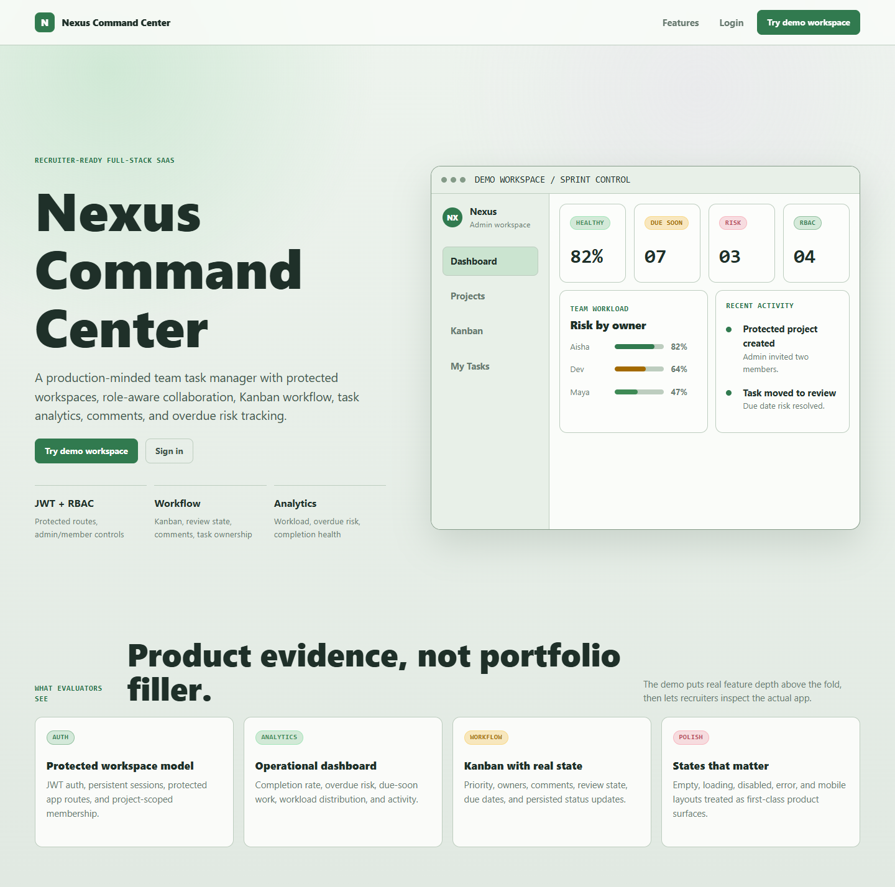
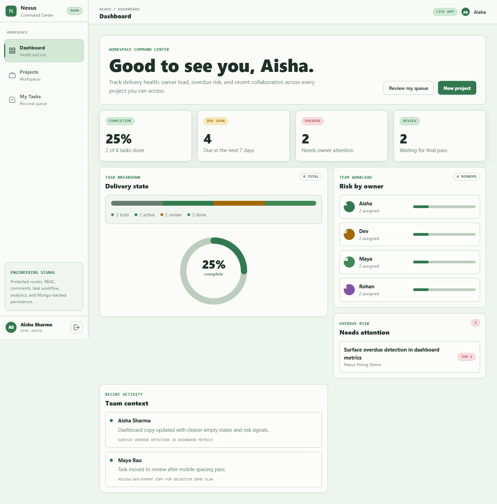
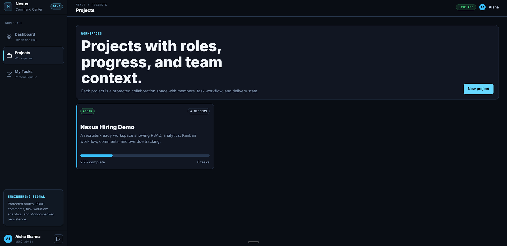
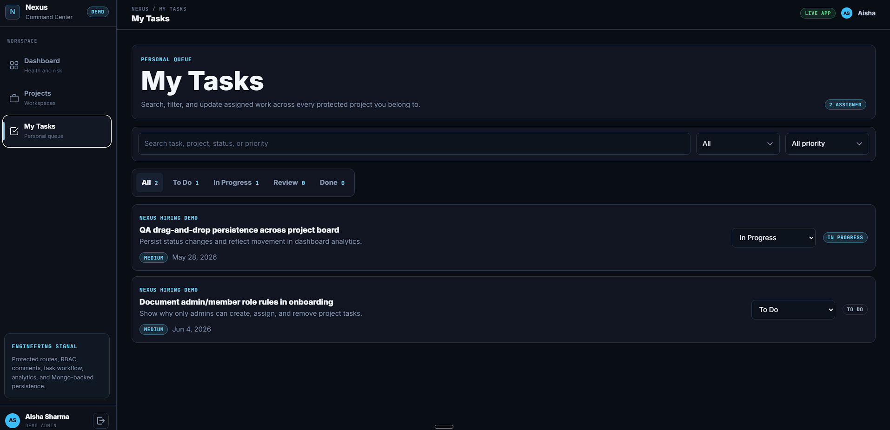

# Nexus Command Center

[](https://github.com/Harshitsharma010/Team-Task-Manager/actions/workflows/ci.yml)

<p align="center">
  <strong>Full-Stack Team Task Management Platform with JWT Auth, RBAC, Kanban Workflow, Analytics, and Vercel Deployment</strong>
</p>

<p align="center">
  Nexus Command Center is a production-minded team task manager for protected workspaces, role-aware collaboration, task workflow tracking, comments, and dashboard analytics.
</p>

<p align="center">
  <a href="https://team-task-manager-ydda.vercel.app/">Live Demo</a>
  ·
  <a href="#screenshots">Screenshots</a>
  ·
  <a href="#features">Features</a>
  ·
  <a href="#api-endpoints">API Endpoints</a>
  ·
  <a href="#local-development-setup">Local Setup</a>
</p>

<p align="center">
  
  
  
  
  
  
</p>

---

## Live Demo

| Resource       | Link                                                                                        |
| -------------- | ------------------------------------------------------------------------------------------- |
| Live App       | [Open Nexus Command Center](https://team-task-manager-ydda.vercel.app/) |
| Demo Workspace | Click **Try demo workspace** on the landing page                                            |
| Deployment     | Vercel                                                                                      |
| Health Check   | [API Health Check](https://team-task-manager-ydda.vercel.app/api/health)                   |

> The demo workspace is pre-seeded with sample team members, projects, assigned tasks, workflow states, and dashboard analytics for quick recruiter review.

---

## Screenshots

| Screen              | Preview                                                |
| ------------------- | ------------------------------------------------------ |
| Landing Page        |           |
| Dashboard Analytics |  |
| Projects Page       |         |
| My Tasks Queue      |        |

---

## Project Overview

**Nexus Command Center** is a full-stack collaboration and task management platform designed for team-based project execution.

It allows users to create projects, manage members, assign tasks, track progress, update workflow states, add comments, and view workspace-level delivery analytics.

This project is built as a portfolio-ready full-stack application to demonstrate practical engineering skills across frontend development, backend API design, authentication, authorization, database modeling, dashboard aggregation, and deployment.

---

## Why This Project Matters

Most beginner task apps only support personal todo creation. Nexus Command Center is built closer to a real team workflow where users need project-level access control, assigned work, due dates, comments, workflow visibility, and dashboard-level progress tracking.

| Area                   | What This Project Demonstrates                                      |
| ---------------------- | ------------------------------------------------------------------- |
| Full-Stack Development | React frontend connected with Express REST APIs                     |
| Authentication         | JWT-based signup, login, and protected routes                       |
| Authorization          | Admin/member role-based access control                              |
| Backend Engineering    | Modular Express routes, middleware, and API structure               |
| Database Design        | MongoDB/Mongoose models with user-project-task relationships        |
| Collaboration          | Project members, task assignment, comments, and status updates      |
| Dashboard Logic        | Aggregated metrics for tasks, workload, overdue items, and progress |
| Deployment Readiness   | Vercel configuration for full-stack production deployment           |

---

## Features

| Feature                   | Description                                                                  |
| ------------------------- | ---------------------------------------------------------------------------- |
| User Authentication       | Secure signup and login using JWT and hashed passwords                       |
| Demo Workspace            | One-click demo workspace with seeded sample data                             |
| Project Management        | Create projects, view project details, and organize team work                |
| Team Members              | Add and remove project members using email                                   |
| Role-Based Access Control | Project admins manage tasks and members; members update assigned task status |
| Task Assignment           | Assign tasks to project members with status, priority, and due date          |
| Kanban Workflow           | Track tasks through `todo`, `inprogress`, `review`, and `done` stages        |
| Task Comments             | Add comments to tasks for discussion and collaboration history               |
| My Tasks View             | View all tasks assigned to the logged-in user                                |
| Search and Filters        | Filter assigned tasks by status, priority, and search terms                  |
| Dashboard Analytics       | Track completed, pending, review, overdue, and due-soon tasks                |
| Workload Summary          | View member-wise workload distribution                                       |
| Production Deployment     | Vercel deployment with frontend rewrites and serverless API routing          |

---

## Tech Stack

| Layer          | Technology                |
| -------------- | ------------------------- |
| Frontend       | React, Vite, React Router |
| Styling        | CSS                       |
| API Client     | Axios                     |
| Backend        | Node.js, Express.js       |
| Database       | MongoDB                   |
| ODM            | Mongoose                  |
| Authentication | JWT, bcrypt/bcryptjs      |
| API Style      | REST API                  |
| Deployment     | Vercel                    |
| Build System   | Vite + Vercel             |
| Runtime        | Node.js 20+               |

---

## System Architecture

```text
User
  |
  v
React + Vite Frontend
  |
  | Axios API requests with JWT bearer token
  v
Express REST API
  |
  | Auth middleware validates token
  v
Route Modules
  |
  |-- /api/auth
  |-- /api/projects
  |-- /api/tasks
  |-- /api/dashboard
  |
  v
Mongoose Models
  |
  |-- User
  |-- Project
  |-- Task
  |
  v
MongoDB Database
```

---

## User Workflow

| Step | Action                                                 |
| ---- | ------------------------------------------------------ |
| 1    | User signs up, logs in, or enters demo workspace       |
| 2    | User creates a project                                 |
| 3    | Project creator becomes project admin                  |
| 4    | Admin adds members by email                            |
| 5    | Admin creates and assigns tasks                        |
| 6    | Members view assigned tasks                            |
| 7    | Members update assigned task status                    |
| 8    | Team discusses task progress through comments          |
| 9    | Dashboard displays project health and workload summary |

---

## Core Modules

| Module          | Responsibility                                                             |
| --------------- | -------------------------------------------------------------------------- |
| Authentication  | Handles signup, login, password hashing, and JWT generation                |
| Auth Middleware | Protects private routes and attaches authenticated user data               |
| Projects        | Handles project creation, project details, members, and permissions        |
| Tasks           | Handles task creation, assignment, status updates, comments, and deletion  |
| Dashboard       | Aggregates task status, overdue work, due-soon work, and workload data     |
| Frontend Pages  | Provides landing, auth, dashboard, projects, project board, and task views |

---

## API Endpoints

Base API URL:

```bash
http://localhost:5000/api
```

Production API URL:

```bash
https://team-task-manager-ydda.vercel.app/api
```

---

### Authentication Routes

| Method | Endpoint       | Auth Required | Description                    |
| ------ | -------------- | ------------- | ------------------------------ |
| POST   | `/auth/signup` | No            | Register a new user            |
| POST   | `/auth/login`  | No            | Log in user and return JWT     |
| POST   | `/auth/demo`   | No            | Create or enter demo workspace |

---

### Project Routes

| Method | Endpoint                        | Auth Required | Permission     | Description                         |
| ------ | ------------------------------- | ------------- | -------------- | ----------------------------------- |
| GET    | `/projects`                     | Yes           | User           | Get projects where user is a member |
| POST   | `/projects`                     | Yes           | User           | Create a new project                |
| GET    | `/projects/:id`                 | Yes           | Project Member | Get project details                 |
| DELETE | `/projects/:id`                 | Yes           | Admin          | Delete project and its tasks        |
| GET    | `/projects/:id/members`         | Yes           | Project Member | Get project members                 |
| POST   | `/projects/:id/members`         | Yes           | Admin          | Add member by email                 |
| DELETE | `/projects/:id/members/:userId` | Yes           | Admin          | Remove project member               |
| GET    | `/projects/:id/tasks`           | Yes           | Project Member | Get project tasks                   |
| POST   | `/projects/:id/tasks`           | Yes           | Admin          | Create task inside project          |

---

### Task Routes

| Method | Endpoint              | Auth Required | Permission              | Description                          |
| ------ | --------------------- | ------------- | ----------------------- | ------------------------------------ |
| GET    | `/tasks/mine`         | Yes           | User                    | Get tasks assigned to logged-in user |
| GET    | `/tasks/:id/comments` | Yes           | Project Member          | Get comments for a task              |
| POST   | `/tasks/:id/comments` | Yes           | Project Member          | Add comment to task                  |
| PATCH  | `/tasks/:id`          | Yes           | Admin / Assigned Member | Update task details or status        |
| DELETE | `/tasks/:id`          | Yes           | Admin                   | Delete task                          |

---

### Dashboard Routes

| Method | Endpoint     | Auth Required | Description                                                                 |
| ------ | ------------ | ------------- | --------------------------------------------------------------------------- |
| GET    | `/dashboard` | Yes           | Get task totals, overdue tasks, due-soon tasks, status counts, and workload |
| GET    | `/health`    | No            | Check backend health                                                        |

---

## Database Design

### User Model

| Field          | Type   | Required | Description            |
| -------------- | ------ | -------- | ---------------------- |
| `name`         | String | Yes      | User's full name       |
| `email`        | String | Yes      | Unique lowercase email |
| `password`     | String | Yes      | Hashed user password   |
| `avatar_color` | String | No       | UI avatar color        |
| `createdAt`    | Date   | Auto     | Creation timestamp     |
| `updatedAt`    | Date   | Auto     | Update timestamp       |

---

### Project Model

| Field         | Type            | Required | Description                           |
| ------------- | --------------- | -------- | ------------------------------------- |
| `name`        | String          | Yes      | Project name                          |
| `description` | String          | No       | Project description                   |
| `color`       | String          | No       | UI project color                      |
| `created_by`  | ObjectId → User | Yes      | User who created the project          |
| `members`     | Array           | Yes      | Project members with role information |
| `createdAt`   | Date            | Auto     | Creation timestamp                    |
| `updatedAt`   | Date            | Auto     | Update timestamp                      |

---

### Project Member Schema

| Field      | Type               | Required | Description                |
| ---------- | ------------------ | -------- | -------------------------- |
| `user`     | ObjectId → User    | Yes      | Project member reference   |
| `role`     | `admin` / `member` | Yes      | Member permission level    |
| `joinedAt` | Date               | Auto     | Date member joined project |

---

### Task Model

| Field         | Type                                      | Required | Description                |
| ------------- | ----------------------------------------- | -------- | -------------------------- |
| `project`     | ObjectId → Project                        | Yes      | Project linked to the task |
| `title`       | String                                    | Yes      | Task title                 |
| `description` | String                                    | No       | Task details               |
| `status`      | `todo` / `inprogress` / `review` / `done` | Yes      | Current task status        |
| `priority`    | `low` / `medium` / `high`                 | Yes      | Task priority              |
| `due_date`    | Date                                      | No       | Task due date              |
| `assigned_to` | ObjectId → User                           | No       | Assigned project member    |
| `created_by`  | ObjectId → User                           | Yes      | User who created the task  |
| `comments`    | Array                                     | No       | Task discussion comments   |
| `createdAt`   | Date                                      | Auto     | Creation timestamp         |
| `updatedAt`   | Date                                      | Auto     | Update timestamp           |

---

### Task Comment Schema

| Field       | Type            | Required | Description       |
| ----------- | --------------- | -------- | ----------------- |
| `user`      | ObjectId → User | Yes      | Comment author    |
| `message`   | String          | Yes      | Comment text      |
| `createdAt` | Date            | Auto     | Comment timestamp |

---

## Local Development Setup

### Prerequisites

| Requirement | Version                        |
| ----------- | ------------------------------ |
| Node.js     | 20+                            |
| npm         | Latest stable                  |
| MongoDB     | MongoDB Atlas or local MongoDB |

---

### 1. Clone the Repository

```bash
git clone https://github.com/Harshitsharma010/Team-Task-Manager.git
cd Team-Task-Manager
```

---

### 2. Install Dependencies

Install backend dependencies:

```bash
npm install --prefix server
```

Install frontend dependencies:

```bash
npm install --prefix frontend
```

---

### 3. Configure Environment Variables

Create a `.env` file inside the `server` folder:

```env
PORT=5000
MONGO_URI=mongodb+srv://<username>:<password>@<cluster>/<database>
JWT_SECRET=replace_with_a_long_random_secret
CLIENT_URL=http://localhost:5173
```

Optional frontend `.env` file:

```env
VITE_API_URL=http://localhost:5000/api
```

---

### 4. Run Backend Server

```bash
npm run dev --prefix server
```

Backend runs at:

```bash
http://localhost:5000
```

Health check:

```bash
http://localhost:5000/api/health
```

---

### 5. Run Frontend App

Open another terminal and run:

```bash
npm run dev --prefix frontend
```

Frontend runs at:

```bash
http://localhost:5173
```

---

## Environment Variables

### Backend Variables

| Variable     | Required | Default                 | Description                        |
| ------------ | -------- | ----------------------- | ---------------------------------- |
| `PORT`       | No       | `5000`                  | Backend server port                |
| `MONGO_URI`  | Yes      | None                    | MongoDB connection string          |
| `JWT_SECRET` | Yes      | None                    | Secret key used to sign JWT tokens |
| `CLIENT_URL` | No       | `http://localhost:5173` | Frontend URL for CORS              |
| `NODE_ENV`   | No       | `development`           | App environment                    |

---

### Frontend Variables

| Variable       | Required | Default | Description                   |
| -------------- | -------- | ------- | ----------------------------- |
| `VITE_API_URL` | No       | `/api`  | API base URL used by frontend |

---

## Project Structure

```text
Team-Task-Manager/
|
|-- frontend/
|   |-- src/
|   |   |-- api/
|   |   |-- components/
|   |   |-- context/
|   |   |-- pages/
|   |   `-- main.jsx
|   |
|   |-- package.json
|   `-- vite.config.js
|
|-- server/
|   |-- middleware/
|   |   `-- auth.js
|   |
|   |-- routes/
|   |   |-- auth.js
|   |   |-- dashboard.js
|   |   |-- projects.js
|   |   `-- tasks.js
|   |
|   |-- index.js
|   |-- initDB.js
|   `-- package.json
|
|-- docs/
|   `-- screenshots/
|       |-- dashboard.png
|       |-- landing.png
|       |-- my-tasks.png
|       `-- projects.png
|
|-- nixpacks.toml
|-- package.json
`-- README.md
```

---

## Deployment

This project is deployed on Vercel as a full-stack app. The frontend is built from `frontend/`, and API traffic is routed through the serverless Express entrypoint in `api/index.js`.

### Vercel Deployment Flow

| Step | Action                                                                     |
| ---- | -------------------------------------------------------------------------- |
| 1    | Push the project to GitHub                                                 |
| 2    | Create or connect a Vercel project from this repository                    |
| 3    | Keep the root directory as the repository root                             |
| 4    | Add required environment variables                                         |
| 5    | Vercel runs the root build command and outputs `frontend/dist`             |
| 6    | `/api/*` requests are routed to the Express serverless function            |

---

### Required Vercel Environment Variables

| Variable     | Required | Description                     |
| ------------ | -------- | ------------------------------- |
| `MONGO_URI`  | Yes      | MongoDB Atlas connection string |
| `JWT_SECRET` | Yes      | Secure JWT signing secret       |
| `VITE_API_URL` | Yes   | Set to `/api`                   |

Optional:

| Variable     | Required | Description                    |
| ------------ | -------- | ------------------------------ |
| `CLIENT_URL` | No       | Vercel or custom frontend URL  |

---

### Common Deployment Issues

| Issue                         | Possible Cause                                     |
| ----------------------------- | -------------------------------------------------- |
| App crashes on startup        | Missing `MONGO_URI` or invalid database connection |
| Login/signup not working      | Missing or weak `JWT_SECRET`                       |
| CORS error                    | Incorrect `CLIENT_URL`                             |
| Frontend not loading          | Frontend build path not found                      |
| Vercel API returns 500        | Missing env vars or MongoDB Atlas network access   |

---

## Current Limitations

| Limitation              | Status                                  |
| ----------------------- | --------------------------------------- |
| Automated tests         | Not added yet                           |
| CI/CD workflow          | Not added yet                           |
| Swagger/OpenAPI docs    | Not added yet                           |
| Email invitations       | Not added yet                           |
| Real-time notifications | Not added yet                           |
| Advanced roles          | Currently supports `admin` and `member` |
| Production monitoring   | Not added yet                           |
| Rate limiting           | Not added yet                           |

---

## Future Improvements

| Area               | Planned Improvement                                                   |
| ------------------ | --------------------------------------------------------------------- |
| Authentication     | Add password reset, email verification, and refresh token flow        |
| Authorization      | Add owner, admin, member, and viewer roles                            |
| Notifications      | Add task assignment and due-date reminders                            |
| Real-Time Features | Add WebSocket-based live updates                                      |
| Analytics          | Add charts for velocity, completion rate, and project health          |
| Testing            | Add backend API tests and frontend component tests                    |
| CI/CD              | Add GitHub Actions build and test pipeline                            |
| Docker             | Add Dockerfile and Docker Compose setup                               |
| API Docs           | Add Swagger/OpenAPI documentation                                     |
| Cloud              | Add AWS or Render deployment guide                                    |
| UX                 | Add saved filters, keyboard shortcuts, and better notification states |

---

## Resume Value

This project demonstrates practical full-stack engineering skills.

| Skill Area           | Evidence in Project                                             |
| -------------------- | --------------------------------------------------------------- |
| React Development    | Multi-page frontend with routing, API calls, and state handling |
| Backend Development  | Express REST API with modular route structure                   |
| Authentication       | JWT-based protected routes                                      |
| Authorization        | Admin/member project-level permissions                          |
| Database Design      | User, Project, Task, Member, and Comment relationships          |
| API Design           | REST endpoints for auth, projects, tasks, and dashboard         |
| Product Thinking     | Real team workflow instead of a simple todo app                 |
| Deployment Readiness | Vercel production configuration                                 |

Suggested resume line:

> Built a full-stack team task management platform with JWT authentication, RBAC, project membership, Kanban task workflows, comments, dashboard analytics, and Vercel deployment using React, Node.js, Express, and MongoDB.

---

## Repository Topics

Recommended GitHub topics:

```text
react
vite
nodejs
express
mongodb
mongoose
jwt-authentication
rbac
rest-api
task-manager
project-management
kanban-board
full-stack
vercel
serverless
```

---

## License

This project is intended for educational, portfolio, and full-stack engineering learning purposes.
